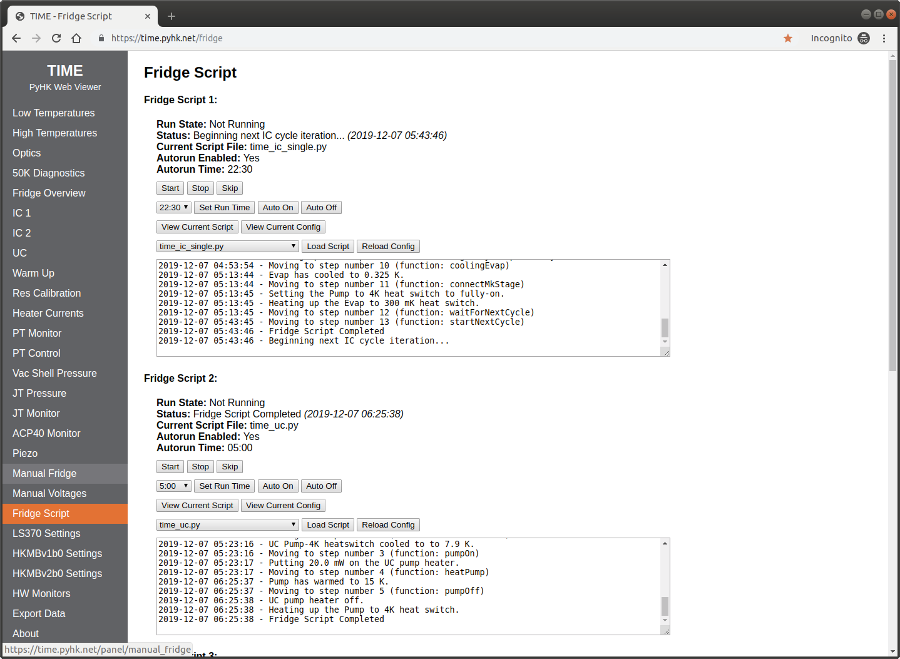

Configuration
************************************************************************

Hardware Configuration Files
========================================================================

The hardware configuration files define the instruments and sensors read
out by ``pyhkd``. Configuration data is stored in the JSON5 format,
which is a superset of the JSON specification that added human-features
such as comments; valid JSON is always valid JSON5, but the reverse is
not true. A valid ``pyhkd`` hardware configuration file consists of a
single list of objects, with each object corresponding to an instrument.

.. code:: javascript

    [
        {
            "type": "a",
            "param0": "value0",
            "param1": 1.0
        },
        {
            "type": "b"
        }
    ]

-  *boolean*: ``true`` or ``false`` (but not ``true`` or ``false``)

-  *integer*: an integer value not enclosed in quotation marks (``4``
   but not ``4`` or ``4.0``)

-  *float*: a number without quotation marks in decimal or exponential
   form (``4``, ``8.0``, ``-1.234e5`` but not ``-1.234e5``), or the
   values ``Infinity``, ``-Infinity``, and ``NaN`` (as allowed in the
   JSON5 specification)

-  *string*: ASCII characters enclosed in double quotation marks
   (``value`` but not ``value``)

-  *list*: A list of items enclosed in square brackets.

-  *object*: A set of “key”:“value” pairs enclosed in curly brackets.

Abstract Devices
------------------------------------------------------------------------

This section documents some of the parameters common to abstract classes
of devices.

Channel
^^^^^^^^^^^^^^^^^^^^^^^^^^^^^^^^^^^^^^^^^^^^^^^^^^^^^^^^^^^^^^^^^^^^^^^^

Identifier: ``Channel``

Parameters specified for a channel, which is a named timestream with one
or more channel types.

-  *string* or *integer* ``id`` – The hardware-facing identifier for the
   channel. It is used to match channel objects to the channels reported
   by the device, and therefore the form and allowed values vary between
   devices. For many instruments this is an integer starting from 0; for
   such instruments, the ``id`` is not explicitly required in the
   ``pyhkd`` configuration file and is implied by the ordering of the
   channel list. Other instruments use string identifiers and therefore
   must be explicitly provided in the configuration. Generally, the list
   of channels for a single instrument should specify an ``id`` for all
   channels or for no channels.

-  *string* ``name`` – The human-facing identifier for the channel. This
   must be globally unique, no two channels in your entire hardware
   config file can share a name. The name (along with the type) is the
   primary link between your ``pyhkweb`` and ``pyhkd`` config files,
   it is shown to the user in ``pyhkweb`` plots or tables, and it is
   URL-encoded to form the name of the main timestream log files.
   Spaces, capital letters, and ASCII special characters are allowed, so
   it is encouraged to chose human-understandable names.

-  *string* ``alias`` – If provided, the alias is treated as a second
   name for the channel (data is stored only once, the alias log files
   are symlinks to the main log files). The alias shares all of the same
   restrictions as the name (the alias cannot match any names or aliases
   in your system). The alias is useful in situations where you need to
   refer to the same channel by different names in different contexts.

-  *string* ``calib_func`` – A string with the name of one of the
   calibration files stored in ``pyhk/pyhkd/calib`` (without the file
   extension, such as ``V2T_DT400``). How (and whether) the calibration
   function is used depends on the instrument. See the Calibration
   section for more details.

-  *boolean* ``save_deriv`` – If ``true``, save the derivative of the
   channel as a separate channel.

-  *integer* ``downsample`` – If a number greater than 1 is provided,
   this is the number of samples to bin together. Data will be stored to
   the disk at the reduced rate.

-  *boolean* ``save_fast`` – If ``true`` and
   :math:`\texttt{downsample}>1`, the full-rate data will be stored
   along side the reduce-rate data. The fast rate data will be available
   for export, but the slow data will be plotted by ``pyhkweb`` by
   default.

-  *float* ``filter`` – A value between 0 and 1 indicating the alpha
   parameter for an exponential moving average filter applied to the 
   measured values.  The default value of 1.0 produces an unfiltered 
   result.

-  *float* ``r_heater`` – Relevant only for voltage output instruments.
   It defines the resistance of the load and is used to compute power
   values.

-  *float* ``r_total`` – Relevant only for voltage output instruments.
   It defines the resistance of the load plus the wiring and is used to
   compute power values.

-  *string* or *list* ``type`` – A string indicating the data type for
   the channel (ex: ``voltage``). Note that for most devices the channel
   type is implied by the channel **id** and does not need to be
   explicitly listed in the configuration file. A channel can have
   multiple unique types which be be specified with a list of types (ex:
   ``[voltage, current]``) or via a special multi-type strings listed
   below. A special class of target-types (ex: ``vtarg`` for voltage)
   corresponds to channels that are set by the user and sent to the
   hardware instead of read from the hardware. For example, a power
   supply with one output channel may have the type
   ``[voltage, current, vtarg]``, which allows a user-commanded voltage,
   a measured voltage, and a measure current all sharing one channel
   name. Note that the units specified are the units for data stored in
   files; plots and tables in ``pyhkweb`` can convert to other
   compatible units.

   .. rubric:: Single Types:
      :name: single-types

   -  ``temperature`` [K]

   -  ``voltage`` [V]

   -  ``resistance`` [Ohms]

   -  ``current`` [A]

   -  ``currentramp`` [A/s] – A current ramping rate

   -  ``power`` [W]

   -  ``bfield`` [T] – Magnetic field

   -  ``pressure`` [Torr]

   -  ``relhumidity`` [%] – Relative humidity

   -  ``energy`` [J]

   -  ``frequency`` [Hz]

   -  ``time`` [s]

   -  ``adu`` [dimensionless] – The count from an ADC

   -  ``dac`` [dimensionless] – The count from a DAC

   -  ``angle`` [deg]

   -  Any of the above types with ``deriv`` added to the end is a valid
      type representing the time derivative of the type in question

   -  ``float`` [dimensionless] – A generic number

   -  ``number`` [dimensionless] – A generic number, typically an
      integer or count

   -  ``fraction`` [dimensionless] – A generic number, typically a
      fraction from 0 to 1

   -  ``state`` [dimensionless] – A number representing the state of an
      object or quantity

   -  ``unused`` – Channel is ignored and not recorded to disk, even if
      reported by the hardware

   .. rubric:: Target Types:
      :name: target-types

   -  ``vtarg`` [V] – Target voltage

   -  ``ptarg`` [W] – Target power

   -  ``ttarg`` [K] – Target temperature

   -  ``itarg`` [A] – Target current

   -  ``irtarg`` [A/s] – Target current ramp rate

   -  ``starg`` [dimensionless] – Target state value

   -  ``outputmode`` [dimensionless] – A special target type used by
      voltage output systems to track whether it is setting voltage or
      power (converted to voltage via provided resistances).

   .. rubric:: Multi-Types:
      :name: multi-types

   -  ``thermometer:diode`` – A voltage-based thermometer. Equivalent to
      ``[voltage, temperature]``.

   -  ``thermometer:diode:exc`` – A voltage-based thermometer with a
      measured excitation current and dissipated power. Equivalent to
      ``[voltage, temperature, current, power]``.

   -  ``thermometer:resistor`` – A resistance-based thermometer.
      Equivalent to ``[resistance, temperature]``.

   -  ``thermometer:resistor:exc`` – A resistance-based thermometer with
      a measured excitation current and dissipated power. Equivalent to
      ``[resistance, temperature, voltage, current, dac]``.

   -  ``heater`` – A basic voltage-output heater. Equivalent to
      ``[voltage, vtarg, outputmode]``.

   -  ``heater:imon`` – A heater with current monitoring. Equivalent to
      ``[voltage, vtarg, current, outputmode]``.

   -  ``heater:setp`` – A heater that can accept power targets
      (converted in ``pyhkd`` to voltage values, requires specified
      resistances). Equivalent to
      ``[voltage, power, outputmode, vtarg, ptarg]``.

   -  ``heater:setp:imon`` – A heater with current monitoring that can
      accept power targets. Equivalent to
      ``[voltage, current, power, outputmode, vtarg, ptarg]``.

   -  ``heater:setpt:imon`` – A heater with current monitoring that can
      accept power and temperature targets. Equivalent to
      ``[voltage, current, power, temperature, outputmode, vtarg, ptarg, ttarg]``.

Instrument
^^^^^^^^^^^^^^^^^^^^^^^^^^^^^^^^^^^^^^^^^^^^^^^^^^^^^^^^^^^^^^^^^^^^^^^^

Identifier: ``Instrument``

Parameters common to all devices that report results for some number of
channels.

-  *list* ``channels`` – A list of zero or more channel parameter
   objects. Typicially instruments expect fixed channel counts and
   types, see the instrument in question for more details.

-  *float* ``wait_time`` – Where relevant, this specificies the
   approximate time in seconds between instrument data requests/updates.

-  *string* ``default_sensor_type`` – The default value of ``type`` used
   for channels that do not specify it. This is typically defined by the
   instrument and does not need to be specified.

-  *string* ``default_calib_func`` – The default value of ``calib_func``
   used for channels that do not specify it.

-  *string* ``default_downsample`` – The default value of ``downsample``
   used for channels that do not specify it.

-  *string* ``default_save_deriv`` – The default value of ``save_deriv``
   used for channels that do not specify it.

-  *string* ``default_save_fast`` – The default value of ``save_fast``
   used for channels that do not specify it.

-  *boolean* ``verbose_rx`` – If ``true``, any relevant debugging
   information about data received from the instrument will be printed
   in the program log. Defaults to ``false``.

-  *boolean* ``verbose_tx`` – If ``true``, any relevant debugging
   information about data sent to the instrument will be printed in the
   program log. Defaults to ``false``.

-  *boolean* ``verbose_fail`` – If ``true``, any relevant debugging
   information about failures with the instrument will be printed in the
   program log. Defaults to ``true``.

-  *boolean* ``verbose_raw`` – If ``true``, any relevant debugging
   information about raw or low-level communication with the instrument
   will be printed in the program log. Defaults to ``false``.

Serial Instrument
^^^^^^^^^^^^^^^^^^^^^^^^^^^^^^^^^^^^^^^^^^^^^^^^^^^^^^^^^^^^^^^^^^^^^^^^

Identifier: ``SerialInstrument``

Parameters common to devices that communicate over a (real or virtual)
serial port.

-  Inherits parameters from ``Instrument``

-  *string* ``port`` – The serial port identifier (ex: ``/dev/ttyUSB0``)

-  *integer* ``baudrate`` – The serial port communication speed (ex:
   ``9600``)

-  *string* ``pkt_end`` – The packet termination string, used in both
   sending and receiving data (ex: ``\n``, ``\r\n``, ``end;``).
   Typically this is set by the inheriting instrument and does not need
   to specified in the configuration file.

-  *string* ``pkt_start`` – The string signifying the start of a packet
   (or an empty string), used in both sending and receiving data (ex:
   ``start:``, ``{``). Typically this is set by the inheriting instrument
   and does not need to specified in the configuration file.

-  *integer* ``bytesize`` – The serial byte size. Valid entries are
   ``8`` (default), ``7``, ``6``, and ``5``. Typically this is set by
   the inheriting instrument and does not need to specified in the
   configuration file.

-  *integer* ``stopbits`` – The number of serial stop bits. Valid
   entries are ``1`` (default) and ``2``. Typically this is set by the
   inheriting instrument and does not need to specified in the
   configuration file.

GPIB SCPI Instrument
^^^^^^^^^^^^^^^^^^^^^^^^^^^^^^^^^^^^^^^^^^^^^^^^^^^^^^^^^^^^^^^^^^^^^^^^

Identifier: ``GPIBSCPIInstrument``

Parameters common to devices that communicate over a GPIB bus.

-  Inherits parameters from ``Instrument``

-  *integer* ``address`` – The GPIB bus address, from 0 and 31 (ex:
   ``12``)

Devices
------------------------------------------------------------------------

Supported devices are listed below:

Prologix GPIB-USB Adapter
^^^^^^^^^^^^^^^^^^^^^^^^^^^^^^^^^^^^^^^^^^^^^^^^^^^^^^^^^^^^^^^^^^^^^^^^

Identifier: ``prologix``

The Prologix GPIB-USB 6.0 adapter, acting as the controller-in-charge
on a GPIB bus.

Example:

.. code:: javascript

        {
            "type": "prologix",
            "port": "/dev/ttyPrologix",
            "subdevices": []
        }

Supported Parameters:

-  Inherits parameters from ``SerialInstrument``

-  *list* ``subdevices`` – A list of subdevice objects that represent
   instruments connected to the GPIB bus. Supported subdevices are found
   in the Subdevices section.

Simulated Data
^^^^^^^^^^^^^^^^^^^^^^^^^^^^^^^^^^^^^^^^^^^^^^^^^^^^^^^^^^^^^^^^^^^^^^^^

Identifier: ``simdata``

A fake instrument that generates a random walk output on each channel
with a data period of ``wait_time``. Accepts any number of channels.

Example:

.. code:: javascript

        {
            "type": "simdata",
            "wait_time": 1.0,
            "channels": 
            [
                {"name": "AI0", "type": "voltage"},
                {"name": "AI1", "type": "voltage"}
            ]
        }

Supported Parameters:

-  Inherits parameters from ``Instrument``

-  *integer* ``delta_sync`` – If provided, a sync number will be
   generated and stored for each data update. The sync number will
   increase by ``delta_sync`` each frame.

Cryomech PT Compressor
^^^^^^^^^^^^^^^^^^^^^^^^^^^^^^^^^^^^^^^^^^^^^^^^^^^^^^^^^^^^^^^^^^^^^^^^

Identifier: ``ptcompressor``

The helium compressor for a Cryomech PT410 or PT415 pulse tube. This
device contains an internal channel list which generates its names from
the ``name_prefix`` parameter.

Example:

.. code:: javascript

        {
            "type": "ptcompressor",
            "port": "/dev/ttyPTC",
            "name_prefix": "PT"
        }

Supported Parameters:

-  Inherits parameters from ``GPIBSCPIInstrument`` (except ``channels``)

-  *string* ``name_prefix`` – The string used to generate the names for
   the fixed internal channel list.

Internal Channels:

.. code:: javascript

        {'name':name_prefix+' Compressor Minutes', 'type':'state'},
        {'name':name_prefix+' Status', 'type':'state'},
        {'name':name_prefix+' Error', 'type':'state'},
        {'name':name_prefix+' H20 In', 'type':'temperature'},
        {'name':name_prefix+' H20 Out', 'type':'temperature'},
        {'name':name_prefix+' Helium', 'type':'temperature'},
        {'name':name_prefix+' Oil', 'type':'temperature'},
        {'name':name_prefix+' Avg High', 'type':'pressure'},
        {'name':name_prefix+' Avg Low', 'type':'pressure'},
        {'name':name_prefix+' Avg Delta', 'type':'pressure'},
        {'name':name_prefix+' High Derivative', 'type':'pressure'},
        {'name':name_prefix+' Motor Current', 'type':'current'}

Lake Shore 218
^^^^^^^^^^^^^^^^^^^^^^^^^^^^^^^^^^^^^^^^^^^^^^^^^^^^^^^^^^^^^^^^^^^^^^^^

Identifier: ``ls218``

Lake Shore 218 voltage-based thermometer readout instrument, connected
via a RS232 (also supported over GPIB, see the Subdevices section).

Example:

.. code:: javascript

        {
            "type": "ls218",
            "port": "/dev/ttyLS218b0",
            "channels": 
            [
                {"name": "50K Head", "calib_func": "V2T_D6068569"},
                {"name": "50K Strap Cold", "calib_func": "V2T_D6064732"},
                {"name": "50K Strap Warm", "calib_func": "V2T_D6070412"},
                {"name": "50K Plate", "calib_func": "V2T_D6070415"},
                {"name": "4K Plate", "calib_func": "V2T_D6070300"},
                {"name": "4K Fridge Bracket", "calib_func": "V2T_D6070404"},
                {"name": "4K Strap Warm", "calib_func": "V2T_D6069937"},
                {"name": "4K Strap Cold", "calib_func": "V2T_D6068568"}
            ]
        }

Supported Parameters:

-  Inherits parameters from ``SerialInstrument``

MKS Pressure Sensor
^^^^^^^^^^^^^^^^^^^^^^^^^^^^^^^^^^^^^^^^^^^^^^^^^^^^^^^^^^^^^^^^^^^^^^^^

Identifier: ``mks_pressure``

MKS pressure sensors including 972B DualMag and 902B

Example:

.. code:: javascript

        {
            "type": "mks_pressure",
            "port": "/dev/ttyTurbo",
            "channels": 
            [
                {"name": "Turbo Station", "type": "pressure"}
            ]
        }

Supported Parameters:

-  Inherits parameters from ``SerialInstrument``

Arduino
^^^^^^^^^^^^^^^^^^^^^^^^^^^^^^^^^^^^^^^^^^^^^^^^^^^^^^^^^^^^^^^^^^^^^^^^

Identifier: ``arduino``

An Arduino or Arduino-compatible device running the firmware included in
``pyhk/firmware/arduino-digital-out``, which provides ``pyhkd`` access
to the digital output pins. This instrument accepts any number of
channels, each of which has the type ``[state,starg]`` with state values
of ``1`` or ``0`` corresponding to digital high and low respectively.
The ``id`` parameter is an integer matching the Arduino pin number in
question. Note that a relay shield can be used with the Arduino to drive
higher power lines.

Example:

.. code:: javascript

        {
            "type": "arduino",
            "port": "/dev/ttyArduino",
            "channels": 
            [
                {"id":7, "name": "PTC Relay"},
                {"id":6, "name": "Relay 2"},
                {"id":5, "name": "Relay 3"},
                {"id":4, "name": "Relay 4"}
            ]
        }

Supported Parameters:

-  Inherits parameters from ``SerialInstrument``

HKMBv2 AC Cernox Readout
^^^^^^^^^^^^^^^^^^^^^^^^^^^^^^^^^^^^^^^^^^^^^^^^^^^^^^^^^^^^^^^^^^^^^^^^

Identifier: ``hkmbv2``

TIME-style AC excitation housekeeping data acquisition box. Matches
readings to MCE sync numbers and IRIG-B timestamps if provided.

Example:

.. code:: javascript

        {
            "type": "hkmbv2",
            "port": "/dev/ttyHKMBv2Box0",
            "serial_num": 0,
            "live_config_filename": "hkmbv2_time.json",
            "channels": 
            [
                // 8 analog inputs are supported with IDs AI0-AI7
                {"id": "AI0", "name": "Piezo PT Motor", "type": "voltage"},
                
                // 24 heaters are supported with IDs H00-H23
                {
                    "id": "H00", "name": "Pump 3 Heater", 
                    "type": "heater:setpt:imon", 
                    "r_heater": 207, "r_total": 229.3
                },

                // 24 thermometers are supported with IDs Tnm for n 0-5 and m 0-4
                {
                    "id": "T00", "name": "350mK Filter", 
                    "calib_func": "R2T_CX69935", 
                    "type": "thermometer:resistor:exc"
                },
                
                // System monitors
                {"id": "A5V", "name": "HKMBv2b0_A5V", "type": "voltage"},
                {"id": "12V", "name": "HKMBv2b0_12V", "type": "voltage"},
                {"id": "3V3", "name": "HKMBv2b0_3V3", "type": "voltage"},
                {"id": "1V8", "name": "HKMBv2b0_1V8", "type": "voltage"},
                {"id": "6V0", "name": "HKMBv2b0_6V0", "type": "voltage"},
                {"id": "14V", "name": "HKMBv2b0_14V", "type": "voltage"},
                {"id": "24V", "name": "HKMBv2b0_24V", "type": "voltage"},
                {"id": "D5V", "name": "HKMBv2b0_D5V", "type": "voltage"},
                {"id": "FPS", "name": "HKMBv2b0_FPS", "type": "frequency"},
                
                // MCE sync number monitor
                {
                    "id": "SYNC", "name": "HKMBv2b0_SYNC", 
                    "type": ["number","frequency","time"]
                },
                
                // Environment monitors
                {
                    "id": "ENV", "name": "Ambient", 
                    "type": ["temperature", "pressure", "relhumidity"]
                },
                {
                    "id": "DEW", "name": "Ambient Dew Point", 
                    "type": "temperature"
                }
            ]
        }

Supported Parameters:

-  Inherits parameters from ``SerialInstrument``

-  *string* ``live_config_filename`` – The file name (not path) to use
   for an automatically-generated JSON configuration file. This
   configuration file should not be manually edited or created and
   should not be reused for other systems. This filename should match
   the one listed in the ``pyhkweb`` configuration file for the HKMB
   settings page.

HKMBv1 DC Diode/Resistor Readout
^^^^^^^^^^^^^^^^^^^^^^^^^^^^^^^^^^^^^^^^^^^^^^^^^^^^^^^^^^^^^^^^^^^^^^^^

Identifier: ``hkmbv1``

TIME-style DC excitation housekeeping data acquisition box. Matches
readings to MCE sync numbers and IRIG-B timestamps if provided.

Example:

.. code:: javascript

        {
            "type": "hkmbv2",
            "port": "/dev/ttyHKMBv2Box0",
            "serial_num": 0,
            "live_config_filename": "hkmbv2_time.json",
            "channels": 
            [
                // 10 analog inputs are supported with IDs AI0-AI9
                {"id": "AI0", "name": "Piezo PT Motor", "type": "voltage"},
                
                // 2 4-20mA inputs are supported with IDs II0-II1
                {"id": "II0", "name": "JT Injection", "type": "current"},
                
                // 32 heaters are supported with IDs H00-H31
                {
                    "id": "H00", "name": "Pump 3 Heater", 
                    "type": "heater:setpt:imon", 
                    "r_heater": 207, "r_total": 229.3
                },

                // 36 thermometers are supported with IDs Tnm for n 0-8 and m 0-4
                {
                    "id": "T00", "name": "350mK Filter", 
                    "calib_func": "R2T_CX69935", 
                    "type": "thermometer:diode:exc"
                },
                
                // 4 fixed reference resistor channels with IDs TT0-TT3
                {
                    "id": "TT0", "name": "HKMBv1b0_TT0", 
                    "type": "thermometer:resistor:exc"
                },
                
                // 8 digital frequency-counter inputs with IDs FM0-FM7
                {"id": "FM0", "name": "HKMBv1b0_FM0", "type": "frequency"},
                
                // System monitors
                {"id": "VM0", "name": "HKMBv1b0_P2V5", "type": "voltage"},
                {"id": "VM1", "name": "HKMBv1b0_N2V5", "type": "voltage"},
                {"id": "VM2", "name": "HKMBv1b0_P5V", "type": "voltage"},
                {"id": "VM3", "name": "HKMBv1b0_N5V", "type": "voltage"},
                {"id": "VM4", "name": "HKMBv1b0_24V", "type": "voltage"},
                {"id": "VM5", "name": "HKMBv1b0_15V", "type": "voltage"},
                {"id": "VM6", "name": "HKMBv1b0_12V", "type": "voltage"},
                {"id": "VM7", "name": "HKMBv1b0_3V3", "type": "voltage"},
                {"id": "FPS", "name": "HKMBv2b0_FPS", "type": "frequency"},
                
                // MCE sync number monitor
                {
                    "id": "SYNC", "name": "HKMBv2b0_SYNC", 
                    "type": ["number","frequency","time"]
                }
            ]
        }

Supported Parameters:

-  Inherits parameters from ``SerialInstrument``

-  *string* ``live_config_filename`` – The file name (not path) to use
   for an automatically-generated JSON configuration file. This
   configuration file should not be manually edited or created and
   should not be reused for other systems. This filename should match
   the one listed in the ``pyhkweb`` configuration file for the HKMB
   settings page.

HKMB Mini ADC Board
^^^^^^^^^^^^^^^^^^^^^^^^^^^^^^^^^^^^^^^^^^^^^^^^^^^^^^^^^^^^^^^^^^^^^^^^

Identifier: ``hkmbminiv1``

TIME-style data acquisition box used for voltage measurement (no
thermometer excitation). Matches readings to MCE sync numbers and IRIG-B
timestamps if provided.

Example:

.. code:: javascript

        {
            "type": "hkmbminiv1",
            "port": "/dev/ttyHKMBMini0",
            "channels": 
            [
                // 5 analog inputs are supported with IDs V10/V20/V30/V40/V50
                {"id": "V00", "name": "Sensor 0", "type": "voltage"},
                
                // System monitor
                {"id": "FPS", "name": "HKMBMINI_FPS", "type": "frequency"},
                
                // MCE sync number monitor
                {
                    "id": "SYNC", "name": "HKMBMINI_SYNC", 
                    "type": ["number","frequency","time"]
                },
                
                // Environment monitors
                {
                    "id": "ENV", "name": "Ambient", 
                    "type": ["temperature", "pressure", "relhumidity"]
                },
                {   "id": "DEW", "name": "Ambient Dew Point", 
                    "type": "temperature"
                }
            ]
        }

Supported Parameters:

-  Inherits parameters from ``SerialInstrument``

-  *string* ``live_config_filename`` – The file name (not path) to use
   for an automatically-generated JSON configuration file. This
   configuration file should not be manually edited or created and
   should not be reused for other systems. This filename should match
   the one listed in the ``pyhkweb`` configuration file for the HKMB
   settings page.

Adixen ACP40 Vacuum
^^^^^^^^^^^^^^^^^^^^^^^^^^^^^^^^^^^^^^^^^^^^^^^^^^^^^^^^^^^^^^^^^^^^^^^^

Identifier: ``adixen_acp``

Adixen ACP40 (or compatible) vacuum pump. This device contains an
internal channel list which generates its names from the ``name_prefix``
parameter.

Example:

.. code:: javascript

        {
            "type": "adixen_acp",
            "port": "/dev/ttyACP40",
            "name_prefix": "ACP40"
        }

Supported Parameters:

-  Inherits parameters from ``SerialInstrument`` (except ``channels``)

-  *string* ``name_prefix`` – The string used to generate the names for
   the fixed internal channel list.

Internal Channels:

.. code:: javascript

        {'name':name_prefix+' Motor', 'type':['frequency','power']},
        {'name':name_prefix+' Converter', 'type':'temperature'},
        {'name':name_prefix+' Status', 'type':'state'},
        {'name':name_prefix+' Fault', 'type':'state'}

MQTT Client
^^^^^^^^^^^^^^^^^^^^^^^^^^^^^^^^^^^^^^^^^^^^^^^^^^^^^^^^^^^^^^^^^^^^^^^^

Identifier: ``mqtt``

Receive numeric values from a MQTT broker (remote or local).

Example:

.. code:: javascript

        {
            "type": "mqtt",
            "address": "127.0.0.1",
            "tls": false,
            "port": 1883, // Typical MQTT non-TLS port
            "clientid": "pyhkd", // Must be unique for the broker
            "verbose": true, // Enable debugging messages
            "channels": 
            [
                {
                    "topic":"$SYS/broker/subscriptions/count", 
                    "name": "Broker Subs", 
                    "type": "number"
                },
                {
                    "topic":"$SYS/broker/uptime", 
                    "name": "Broker Uptime", 
                    "type": "time", 
                    // Take only part of the string
                    "stringdelim":" ", 
                    "stringindex":0
                },  
                {
                    "topic":"test/temperature/incelcius", 
                    "name": "Test B", 
                    // Convert to standard units before saving
                    "type": ["unused","temperature"], 
                    "calib_func": "C2K"
                },
            ],
            "patterns":
            [
                {
                    "names":
                    {
                        "E5:02:62:40": "Location A",
                        "E5:01:A1:26": "Location B",
                    },
                    "channels": 
                    [
                        {
                            "topic":"device/%s/pressure", 
                            "name": "%s", 
                            "type": "pressure"
                        },
                        {
                            "topic":"device/%s/humidity", 
                            "name": "Test %s", 
                            "type": "relhumidity"
                        }
                    ]
                }
            ]
        }

Supported Parameters:

-  Inherits parameters from ``Instrument``

-  *string* ``address`` – IP address or domain name of the MQTT broker.

-  *integer* ``port`` – Communications port for MQTT broker.

-  *boolean* ``tls`` – If ``true``, TLS is enabled when communicating
   with the MQTT broker. Inferred from the port if not provided.

-  *string* ``clientid`` – The name to provide the MQTT broker when
   connecting. Must be unique for the broker.

-  *boolean* ``verbose`` – If ``true``, any relevant debugging
   information about data received will be printed in the program log.
   Defaults to ``false``.

-  *list* ``channels`` – In addition to the fields/requirements
   inherited from ``Instrument``, the following parameters are supported
   by specified channels:

   -  *string* ``topic`` – The MQTT topic to subscribe to. Typical MQTT
      wildcards are supported.

   -  *string* ``stringdelim`` – If provided with ``stringindex``, the
      MQTT string received for the specified topic will be split into an
      array based on this delimiter, and only a single entry will be
      interpreted as the value for this channel. This is useful when
      multiple values are included in a single field payload or when
      extra text needs to be stripped out.

   -  *integer* ``stringindex`` – If provided with ``stringdelim``, the
      array index to choose.

-  *list* ``patterns`` – A list of patterns used to auto-generate
   additional channels beyond those specified in “channels”. This helps
   avoid repetitive configuration data when the same set of topics is
   being read for multiple different devices. Each pattern is an
   ``object`` with the following fields:

   -  *list* ``channels`` – A list of channels to be repeated. The
      *topic* and *name* fields must each contain the string “%s”
      exactly once to indicate the position where string substitution
      occurs.

   -  *object* ``names`` – A set of “key”:“value” pairs where the key is
      the string substituted into the channel *topic* and the value is
      the string substituted into the channel *name*.

Subdevices
------------------------------------------------------------------------

Supported subdevices are listed below:

Lake Shore 370
^^^^^^^^^^^^^^^^^^^^^^^^^^^^^^^^^^^^^^^^^^^^^^^^^^^^^^^^^^^^^^^^^^^^^^^^

Identifier: ``ls370``

Lake Shore 370 resistance-based thermometer readout instrument with a
16x multiplexer, connected via a GPIB bus.

Example:

.. code:: javascript

        {
            "type": "prologix",
            "port": "/dev/ttyPrologix",
            "subdevices":   
            [
                {
                    "type": "ls370",
                    "address": 13,
                    "live_config_filename": "ls370_time.json",
                    "channels": 
                    [                                       
                        {"name": "Pump 1", "calib_func": "R2T_CX64716"},
                        {"name": "Pump 2", "calib_func": "R2T_CX63814"},
                        {"name": "Evap 1", "calib_func": "R2T_CX63836"},
                        {"name": "Evap 2", "calib_func": "R2T_CX63842"},
                        {"name": "1K Plate", "calib_func": "R2T_X29903"},
                        {"name": "1K Pot", "calib_func": "R2T_X30670_2018"},
                        {"name": "350mK Box", "calib_func": "R2T_RU8841_2018"},
                        {"name": "Fridge IC", "calib_func": "R2T_X139541_2018"},                            
                        {"name": "Calib (X59077)", "calib_func": "R2T_CX59077"},
                        {"name": "Calib (X63838)", "calib_func": "R2T_CX63838"},
                        {"name": "1K Plate #2", "calib_func": "R2T_GRT28581"},
                        {"name": "1K Lens Top", "calib_func": "R2T_X50720"},
                        {"name": "Fridge UC", "calib_func": "R2T_X107797"},
                        {"name": "FPU #2", "calib_func": "R2T_X63840_2018"},
                        {"name": "1K Lens", "calib_func": "R2T_RU3000_2018"},
                        {"name": "350mK Panel", "calib_func": "R2T_GRT29284"}
                    ]
                }
            ]
        }

Supported Parameters:

-  Inherits parameters from ``GPIBSCPIInstrument``

-  *string* ``live_config_filename`` – The file name (not path) to use
   for an automatically-generated JSON configuration file for your
   system’s Lake Shore 370. This configuration file should not be
   manually edited or created and should not be reused for other
   systems. This filename should match the one listed in the
   ``pyhkweb`` configuration file for the Lake Shore 370 settings page.

Lake Shore 218
^^^^^^^^^^^^^^^^^^^^^^^^^^^^^^^^^^^^^^^^^^^^^^^^^^^^^^^^^^^^^^^^^^^^^^^^

Identifier: ``ls218``

Lake Shore 218 voltage-based thermometer readout instrument, connected
via a GPIB bus (also supported over RS232, see the Subdevices section).

Example:

.. code:: javascript

        {
            "type": "prologix",
            "port": "/dev/ttyPrologix",
            "subdevices":   
            [
                {
                    "type": "ls218",
                    "address": 8,
                    "channels": 
                    [
                        {"name": "50K Head", "calib_func": "V2T_D6068569"},
                        {"name": "50K Strap Cold", "calib_func": "V2T_D6064732"},
                        {"name": "50K Strap Warm", "calib_func": "V2T_D6070412"},
                        {"name": "50K Plate", "calib_func": "V2T_D6070415"},
                        {"name": "4K Plate", "calib_func": "V2T_D6070300"},
                        {"name": "4K Fridge Bracket", "calib_func": "V2T_D6070404"},
                        {"name": "4K Strap Warm", "calib_func": "V2T_D6069937"},
                        {"name": "4K Strap Cold", "calib_func": "V2T_D6068568"}
                    ]
                }
            ]
        }

Supported Parameters:

-  Inherits parameters from ``GPIBSCPIInstrument``

AMI420 Magnet Controller
^^^^^^^^^^^^^^^^^^^^^^^^^^^^^^^^^^^^^^^^^^^^^^^^^^^^^^^^^^^^^^^^^^^^^^^^

Identifier: ``ami420``

AMI 420 magnet power supply controller. This device contains one channel
with many types (``voltage``, ``current``, ``bfield``, ``state``,
``itarg``, ``irtarg``, ``starg``). The name of this channel is taken
from ``name_prefix`` instead of from a channels list.

Example:

.. code:: javascript

        {
            "type": "prologix",
            "port": "/dev/ttyPrologix",
            "subdevices":   
            [
                {
                    "type": "ami420",
                    "address": 22,
                    "name_prefix": "ADR"
                }
            ]
        }

Supported Parameters:

-  Inherits parameters from ``GPIBSCPIInstrument`` (except ``channels``)

-  *string* ``name_prefix`` – The string used to generate the names for
   the fixed internal channel list.

Agilent E3631A
^^^^^^^^^^^^^^^^^^^^^^^^^^^^^^^^^^^^^^^^^^^^^^^^^^^^^^^^^^^^^^^^^^^^^^^^

Identifier: ``agilent_e3631a``

Triple-output HP, Agilent, or Keysight power supplies with GPIB control.
Expects three channels in the configuration file with ``id`` parameters
of ``P6V``, ``P25V``, and ``N25V`` corresponding to the positive 6V,
positive 25V, and negative 25V outputs respectively. The ``id``
parameters are implied by the order of the channels if not provided.

Example:

.. code:: javascript

        {
            "type": "prologix",
            "port": "/dev/ttyPrologix",
            "subdevices":   
            [
                {
                    "type": "agilent_e3631a",
                    "address": 1,
                    "channels": 
                    [
                        {"id": "P6V", "name": "2K Heater"},
                        {"id": "P25V", "name": "IC Heater"},
                        {"id": "N25V", "name": "UC Heater"}
                    ]
                }
            ]
        }

Supported Parameters:

-  Inherits parameters from ``GPIBSCPIInstrument``

Additional Channel Parameters:

-  *float* ``current_limit`` – Defines the current limit of the output
   channel in amps.

Agilent E3647A-E3649A
^^^^^^^^^^^^^^^^^^^^^^^^^^^^^^^^^^^^^^^^^^^^^^^^^^^^^^^^^^^^^^^^^^^^^^^^

Identifier: ``agilent_e36XXa`` for ``XX`` in [46, 47, 48, 49]

Dual-output HP, Agilent, or Keysight power supplies with GPIB control.
Expects two channels in the configuration file.

Example:

.. code:: javascript

        {
            "type": "prologix",
            "port": "/dev/ttyPrologix",
            "subdevices":   
            [
                {
                    "type": "agilent_e3648a",
                    "address": 9,
                    "channels": 
                    [
                        {"name": "4He HS"},
                        {"name": "3He HS"}
                    ]
                }
            ]
        }

Supported Parameters:

-  Inherits parameters from ``GPIBSCPIInstrument``

Additional Channel Parameters:

-  *float* ``current_limit`` – Defines the current limit of the output
   channel in amps.

-  *string* ``output_range`` – Defines the output voltage range setting
   of the device on devices with multiple output ranges. Valid entries
   for most devices are ``HIGH`` and ``LOW``, as specified in the power
   supply manual. Voltage ranges are set when ``pyhkd`` starts and
   currently cannot be changed while running.

Agilent E3632A-E3634A and E3640A-E3645A
^^^^^^^^^^^^^^^^^^^^^^^^^^^^^^^^^^^^^^^^^^^^^^^^^^^^^^^^^^^^^^^^^^^^^^^^
Identifier: ``agilent_e36XXa`` for ``XX`` in [32, 33, 34, 40, 41, 42, 43, 44, 45]

Single-output HP, Agilent, or Keysight power supplies with GPIB control.
Expects one channel in the configuration file.

Example:

.. code:: javascript

        {
            "type": "prologix",
            "port": "/dev/ttyPrologix",
            "subdevices":   
            [
                {
                    "type": "agilent_e3641a",
                    "address": 30,
                    "channels": 
                    [
                        {"name": "4He HS"}
                    ]
                }
            ]
        }

Supported Parameters:

-  Inherits parameters from ``GPIBSCPIInstrument``

Additional Channel Parameters:

-  *float* ``current_limit`` – Defines the current limit of the output
   channel in amps.

-  *string* ``output_range`` – Defines the output voltage range setting
   of the device on devices with multiple output ranges. Valid entries
   for most devices are ``HIGH`` and ``LOW``, as specified in the power
   supply manual. Voltage ranges are set when ``pyhkd`` starts and
   currently cannot be changed while running.

Calibration Files
========================================================================

The calibration configuration files define the conversion functions
between types within a channel in ``pyhkd``. For example, a piece of
hardware may measure a resistance for a thermometer which is converted
to temperature by a calibration function. Calibrations functions are
specified on a per-channel basis using the ``(`` calib\_func) parameter
described previously. Several forms are allowed for calibration files
(but only one form should be provided for a given file name). The files
should be stored in subfolders of ``pyhk/pyhkd/calib``.

Interpolation Files
------------------------------------------------------------------------

Files with the extension ``.interp`` are text files containing a pair of
numbers on each line separated by a space. The left field is the
independent variable (the raw value provided by the hardware, often
voltage or resistance), and the right field is the dependent variable
(what we are converting into, often temperature or pressure).
Python-style comments are allowed. The data is sorted by ``pyhkd`` when
loaded, so data order in the file is not important. Data need not be
monotonic, but in many cases it should be.

Example:

.. code:: python

        # Segment of a sample interp file
        # R[Ohm] T[K]
        116.595 75
        118.318 73
        120.123 71
        121.235 69.8
        121.602 69.4
        121.986 69
        122.367 68.6
        122.744 68.2
        123.137 67.8
        123.527 67.4
        123.920 67
        124.332 66.6

Lake Shore Coefficient Files
------------------------------------------------------------------------

Standard resistance or voltage ``.cof`` calibration files provided by
Lake Shore can be loaded directly, no changes to the file are required.
If a file is found that fails to load or function as expected, please
report it to the PyHK maintainer so the code can be updated (variations
to the file format may occur).

Python Files
------------------------------------------------------------------------

Any Python function that takes one argument and returns one value can be
used. Place the function in a ``.py`` file in the calibration folder,
and be sure the function name matches the file name. Several helper
functions are available to import and call for common function types,
including ``R2T_inverse_polylog``, ``R2T_chebyshev``, and
``R2T_polynomial`` (available in
``pyhk/pyhkd/calib/temperature/helpers.py``).

Example:

.. code:: python

        # He4 Cond in K0 fridge (CX45972)
        from .helpers import R2T_inverse_polylog
        R2T_He4_Cond_K0_A = [2.0668, -0.7469, 0.073751, -0.0009101]
        def R2T_He4_Cond_K0(inRes):
            return R2T_inverse_polylog(inRes, R2T_He4_Cond_K0_A)

Website Configuration Files
========================================================================

The website configuration files define the plots, tables, and setting
pages shown by ``pyhkweb``. Configuration data is stored in the JSON5
format, which is a superset of the JSON specification that added
human-features such as comments; valid JSON is always valid JSON5, but
the reverse is not true. A valid ``pyhkweb`` configuration file
consists of a single list of objects, with each object corresponding to
a page on the web interface. A simple mock-configuration with two pages
is shown below.

.. code:: javascript

    [
        {
            "page_title": "a",
            "page_type": "type0",
            "param1": 1.0
        },
        {
            "page_title": "b",
            "page_type": "type3"
        }
    ]

If you made changes to your existing config file, you can load the
changes with the command ``sudo service apache2 restart``. You do NOT
need to run ``pyhk/pyhkweb/conf_apache.py`` again, this is only used for
the initial setup; simply restarting apache loads config file changes.

Generally each page has a ``page_title`` (shown to the user) and a
``page_type``. Note that some special characters (like slashes) are not
currently supported in page titles. Valid ``page_type`` values and their
parameters are as follows:

Pages
------------------------------------------------------------------------

Interactive Plot
^^^^^^^^^^^^^^^^^^^^^^^^^^^^^^^^^^^^^^^^^^^^^^^^^^^^^^^^^^^^^^^^^^^^^^^^

Identifier: ``plot``

An interactive plot showing live and archived values for a provided set
of sensors. Values update every few seconds without needing to refresh
the page. A date-picker allows for browsing of archival data.

Example:

.. code:: javascript

        {
            "page_title":"Low Temperatures",
            "page_type":"plot",
            "plots":
            [
                {
                    "subfolder_label":"temperature",
                    "log_scale":false,
                    "names": ["1K Pot", "1K Plate", "Evap 1"],
                    "colors": ["blue","darkblue","green"],
                    "linestyles": ["solid","dashed","dotted"]
                }
            ]
        }

Supported Parameters:

-  *string* ``page_title`` – The user-facing title of the page. Spaces
   and capital letters are allowed, but other special characters should
   be avoided. Slashes are not supported. All pages should have a unique
   title.

-  *list* ``plots`` – A list of one or more objects, each describing a
   plot to display on this page. (Multiple plot objects on one page
   share an x axis and should be considered a beta feature; this mode is
   not as well tested as single plots.) Plot object parameters are as
   follows:

   -  *string* ``subfolder_label`` – The channel ``type`` parameter to
      display for this plot.

   -  *boolean* ``log_scale`` – If ``true``, a log scale is used for the
      y axis. Otherwise, a linear scale is used.

   -  *list* ``names`` – A list of channel names to display in this plot
      (matching channel names from the ``pyhkd`` configuration file).

   -  *list* ``colors`` – A list (matching ``names`` in length) of color
      names used when plotting the respective channels. All valid HTML
      color names are accepted.

   -  *list* ``linestyles`` – A list (matching ``names`` in length) of
      line style names used when plotting the respective channels. Valid
      entries are ``solid``, ``dashed``, and ``dotted``.

   -  *string* ``units`` – Units to convert data to before plotting. For
      example, temperature data is stored internally in Kelvin, but can
      be displayed in Fahrenheit by setting ``units`` to ``F``. Unit
      conversion functions can be found in
      ``pyhk/common/units/units.py`` and have names of the form ``a2b``
      where ``a`` is the base unit string and is the string provided for
      the ``unit`` parameter (for the previous example, the function
      ``K2F`` is checked for and loaded).

Demonstration:

Tables
^^^^^^^^^^^^^^^^^^^^^^^^^^^^^^^^^^^^^^^^^^^^^^^^^^^^^^^^^^^^^^^^^^^^^^^^

Identifier: ``tables``

A set of one or more tables showing live values for a provided set of
sensors. Values update every few seconds without needing to refresh the
page.

Example:

.. code:: javascript

        {
            "page_title":"HW Monitors",
            "page_type":"tables",
            "tables":
            [
                {
                    "title": "Power Supplies",
                    "subfolder_label":"voltage",
                    "names": ["HKMBv2b0_A5V","HKMBv2b0_12V","HKMBv2b0_3V3"]
                },
                {
                    "title": "Temperature",
                    "subfolder_label":"temperature",
                    "names": ["Ambient","Ambient Dew Point"]
                }
            ]
        }

Supported Parameters:

-  *string* ``page_title`` – The user-facing title of the page. Spaces
   and capital letters are allowed, but other special characters should
   be avoided. Slashes are not supported. All pages should have a unique
   title.

-  *list* ``tables`` – A list of one or more objects, each describing a
   table to display on this page. Table object parameters are as
   follows:

   -  *string* ``title`` – The title do display above the table.

   -  *string* ``subfolder_label`` – The channel ``type`` parameter to
      display for this table.

   -  *list* ``names`` – A list of channel names to display in this
      table (matching channel names from the ``pyhkd`` configuration
      file).

Demonstration:

Cryomech PT Compressor Control
^^^^^^^^^^^^^^^^^^^^^^^^^^^^^^^^^^^^^^^^^^^^^^^^^^^^^^^^^^^^^^^^^^^^^^^^

Identifier: ``pt``

A control panel that allows remote operation of a Cryomech PT410 or
PT415 helium compressor.

Example:

.. code:: javascript

        {
            "page_title":"PT Control",
            "page_type":"pt",
            "name_prefix":"PT"
        }

Supported Parameters:

-  *string* ``page_title`` – The user-facing title of the page. Spaces
   and capital letters are allowed, but other special characters should
   be avoided. Slashes are not supported. All pages should have a unique
   title.

-  *string* ``name_prefix`` – The value of ``name_prefix`` provided to
   the corresponding ``ptcompressor`` instrument in ``pyhkd``.

Demonstration:

Voltage Control Panel
^^^^^^^^^^^^^^^^^^^^^^^^^^^^^^^^^^^^^^^^^^^^^^^^^^^^^^^^^^^^^^^^^^^^^^^^

Identifier: ``heaters``

A basic control panel for a provided list of voltage outputs.

Example:

.. code:: javascript

        {
            "page_title":"Manual Voltages",
            "page_type":"heaters",
            "use_power":true,
            "names": ["Evap 1 Heater", "Evap 2 Heater", "HS 3 Heater", "HS 6 Heater"]
        }

Supported Parameters:

-  *string* ``page_title`` – The user-facing title of the page. Spaces
   and capital letters are allowed, but other special characters should
   be avoided. Slashes are not supported. All pages should have a unique
   title.

-  *list* ``names`` – A list of voltage channel names to display
   controls for. For controls to work, names must match those provided
   in the ``pyhkd`` configuration file.

-  *boolean* ``use_power`` – If ``true``, allow the display and setting
   of power in addition to the voltage. Defaults to ``false``. Powers
   are computed from the provided ``r_heater`` and ``r_total`` provided
   for the channel in the ``pyhkd`` configuration file.

-  *boolean* ``use_temperature`` – If ``true``, allow the display and
   setting of temperature in addition to the voltage. Defaults to
   ``false``. Requires the instrument to support PID functions.

Demonstration:

Custom Panel
^^^^^^^^^^^^^^^^^^^^^^^^^^^^^^^^^^^^^^^^^^^^^^^^^^^^^^^^^^^^^^^^^^^^^^^^

Identifier: ``panel``

A custom heater/thermometer monitor and control panel. A series of
“widgets” that control one heater are displayed over a static background
image.

Example:

.. code:: javascript

        {
            "page_title":"Manual Fridge",
            "page_type":"panel",
            "background":"time-fridge-panel.png",
            "use_power":true,
            "widget_width":150,
            "widget_height":100,
            "widgets": [
                {
                    "widget_type":"heater_control",
                    "label":"HS 1", "name_v":"HS 1 Heater", 
                    "name_t":"HS 1", "xpos":236, "ypos":222
                },
                {
                    "widget_type":"heater_control",
                    "label":"HS 2", "name_v":"HS 2 Heater", 
                    "name_t":"HS 2", "xpos":236, "ypos":368
                },
                {
                    "widget_type":"value", 
                    "subfolder_label":"temperature", 
                    "name":"4K Head", "xpos":710, "ypos":279
                }
            ]
        }

Supported Parameters:

-  *string* ``page_title`` – The user-facing title of the page. Spaces
   and capital letters are allowed, but other special characters should
   be avoided. Slashes are not supported. All pages should have a unique
   title.

-  *string* ``background`` – The file name (not path) of the background
   image to display behind the panel. Images should be stored in
   ``pyhk/pyhkweb/static/``.

-  *boolean* ``use_power`` – If ``true``, allow the display and setting
   of power in addition to the voltage. Defaults to ``false``. Powers
   are computed from the provided ``r_heater`` and ``r_total`` provided
   for the channel in the ``pyhkd`` configuration file.

-  *integer* ``widget_width`` – The bounding box width for a single
   widget, measured in pixels.

-  *integer* ``widget_height`` – The bounding box height for a single
   widget, measured in pixels.

-  *list* ``widgets`` – A list of widget objects to display on the
   panel. Widget parameters are as follows:

   -  *string* ``widget_type`` – ``heater_control`` for a heater control
      widget, or ``value`` for a simple sensor value

   -  *integer* ``xpos`` – Horizontal position of the widget with
      respect to the background image (measured in pixels).

   -  *integer* ``ypos`` – Vertical position of the widget with respect
      to the background image (measured in pixels).
            
   -  *string* ``label`` –  Valid for ``heater_control`` widgets only.
      The user-facing widget label, displayed at
      the top of the widget.

   -  *string* ``name_v`` – Valid for ``heater_control`` widgets only.
      The name of voltage channel for the widget
      (should match one of the channel names from the
      ``pyhkd`` configuration file)

   -  *string* ``name_t`` – Valid for ``heater_control`` widgets only.
      The name of temperature channel for the widget 
      (should match one of the channel names from the
      ``pyhkd`` configuration file)
      
   -  *string* ``name`` – Valid for ``value`` widgets only.
      The name of sensor channel for the widget 
      (should match one of the channel names from the
      ``pyhkd`` configuration file)
      
   -  *string* ``subfolder_label`` – Valid for ``value`` widgets only.
      The sensor type to display (e.g. ``temperature``, ``pressure``, etc.)

Demonstration:

Fridge Script Control Panel
^^^^^^^^^^^^^^^^^^^^^^^^^^^^^^^^^^^^^^^^^^^^^^^^^^^^^^^^^^^^^^^^^^^^^^^^

Identifier: ``fridge``

Allows user control of any currently running instances of
``pyhkfridge``, which are auto-detected.

Example:

.. code:: javascript

        {
            "page_title":"Fridge Script",
            "page_type":"fridge"
        }

Supported Parameters:

-  *string* ``page_title`` – The user-facing title of the page. Spaces
   and capital letters are allowed, but other special characters should
   be avoided. Slashes are not supported. All pages should have a unique
   title.

Demonstration:

Lake Shore 370 Settings
^^^^^^^^^^^^^^^^^^^^^^^^^^^^^^^^^^^^^^^^^^^^^^^^^^^^^^^^^^^^^^^^^^^^^^^^

Identifier: ``ls370``

User-modifiable settings for a Lake Shore 370.

Example:

.. code:: javascript

        {
            "page_title":"LS370 Settings",
            "page_type":"ls370",
            "filename":"ls370_time.json"
        }

Supported Parameters:

-  *string* ``page_title`` – The user-facing title of the page. Spaces
   and capital letters are allowed, but other special characters should
   be avoided. Slashes are not supported. All pages should have a unique
   title.

-  *string* ``filename`` – The file name (not path) of the Lake Shore
   370 auto-generated configuration file, as specified in the
   ``pyhkd`` configuration file.

Demonstration:

HKMB Settings
^^^^^^^^^^^^^^^^^^^^^^^^^^^^^^^^^^^^^^^^^^^^^^^^^^^^^^^^^^^^^^^^^^^^^^^^

Identifier: ``hkmb``

User-modifiable settings for one of the HKMB family of instruments (v2,
v1, or v1 mini).

Example:

.. code:: javascript

        {
            "page_title":"HKMBv1b0 Settings",
            "page_type":"hkmb",
            "filename":"hkmbv1_time.json"
        }

Supported Parameters:

-  *string* ``page_title`` – The user-facing title of the page. Spaces
   and capital letters are allowed, but other special characters should
   be avoided. Slashes are not supported. All pages should have a unique
   title.

-  *string* ``filename`` – The file name (not path) of the HKMB
   auto-generated configuration file, as specified in the
   ``pyhkd`` configuration file.

Data Export
^^^^^^^^^^^^^^^^^^^^^^^^^^^^^^^^^^^^^^^^^^^^^^^^^^^^^^^^^^^^^^^^^^^^^^^^

Identifier: ``export``

A page that allows exporting of any timestream data over a provided date
range.

Example:

.. code:: javascript

        {
            "page_title":"Export Data",
            "page_type":"export"
        }

Supported Parameters:

-  *string* ``page_title`` – The user-facing title of the page. Spaces
   and capital letters are allowed, but other special characters should
   be avoided. Slashes are not supported. All pages should have a unique
   title.

Demonstration:

Virtual Pages
------------------------------------------------------------------------

Internal Settings
^^^^^^^^^^^^^^^^^^^^^^^^^^^^^^^^^^^^^^^^^^^^^^^^^^^^^^^^^^^^^^^^^^^^^^^^

Identifier: ``internal_settings``

An optional virtual page containing site-wide settings. No actual page
is generate, and no ``page_title`` should be provided.

Example:

.. code:: javascript

        {
            "page_type":"internal_settings",
            "maintenance_mode": false,
            "site_name": "TIME"
        }

Supported Parameters:

-  *string* ``site_name`` – A short string displayed in the upper left
   corner of the website. This helps to differentiate multiple systems
   running PyHK.

-  *boolean* ``maintenance_mode`` – If ``true``, a warning banner is
   shown at the top of the website indicating that the site is
   undergoing maintenance. The site continues to function normally.

Fridge Scripts
========================================================================

``pyhkfridge`` script files are Python files stored in
``pyhk/pyhkfridge/scripts`` that define a set of rules for moving
between states. The main state variable of a running script is the
current step index, which maps directly to a function you have written.
These functions, called “steps”, should be quick segments of code
(executing in less than a second) that consult a series of values (time,
temperature, etc.) and decide to either (A) remain at the current step
index or (B) move to a different step index. Steps may also change other
system state variables (voltages, etc.). Every few seconds
``pyhkfridge`` executes the current step function; this is repeated
until the script terminated.

Each script should define a class named ``FridgeScript`` that inherits
from ``FridgeScriptBase``.

TODO: Document all functions

Example:

.. code:: python

    # pyhkfridge demo script.  This does not show all of the
    # features, just a basic set.  (I encourage you to look
    # at, for example, the TIME or SK fridge cycles if you
    # are interested in more advanced features.)

    import datetime
    import numpy as np
    import time

    from pyhkfridgelib.fridge_script_base import *

    # All fridge scripts must implement a class named FridgeScript
    # that inherits from FridgeScriptBase
    class FridgeScript(FridgeScriptBase):

        # One can define any global constants here
        THERMOMETER_NAME = "4K Head"
        HEATER_NAME = "FPU Heater"

        # FridgeScript.get_steps() should return a list of 
        # functions that define the steps in order.  They
        # can have arbitrary names, and functions can be
        # reused for different steps. Each step should
        # be a quick operation that returns in no more
        # than ~5 seconds.  The current step is called
        # at most once per second until the controller
        # is told to switch steps.
        def get_steps(self):
            # Note: functions should be named something more descriptive!
            return [self.do_a_thing,
                self.wait_to_cool,
                self.step2,
                self.step_heater_wait,
                self.step4]
                    
        # This is the first step (because it is the first
        # step in the list returned by get_steps(), NOT
        # because of its name). 
        def do_a_thing(self):

            # Here I add a message to the log file.  This shows
            # under "Status" on the fridge control webpage,
            # and is added to the log.  The log is saved and
            # is viewable on the website.
            self.show_status('Starting demo, turning off heater ' + self.HEATER_NAME)
            
            # Set a voltage to 0V.  Check fridge_script_base.py
            # for other available set functions (like set_power).
            self.set_voltage(self.HEATER_NAME, 0.0)
            
            # Tell the fridge script controller to move to
            # the next step.  This step will not be called
            # again.  In this case, wait_to_cool is the 
            # next step and will be called in ~1 sec.
            self.move_to_next_step()

        # This is the second step
        def wait_to_cool(self):

            # Here I check a temperature.  Check fridge_script_base.py
            # for other available get functions (like get_voltage).
            t = self.get_temperature(self.THERMOMETER_NAME)
            
            # Show a status message without adding it to the log.
            # This helps keep the log from being cluttered with
            # messages that get repeated a lot.
            self.show_status('Waiting on temperature, currently %f...' % t, add_to_log=False)
            
            # We only call move_to_next_step after a certain condition
            # is met.  This means that this function (wait_to_cool)
            # will be called repeatedly (about once per second)
            # until the condition is met.  Because the function
            # returns between each check, the script controller
            # is able to stop/skip the step and update the status.
            # If you do an infinite loop here (if the function never
            # returns), the script will work but the control interface
            # will appear to be frozen.
            if t < 10:
                self.show_status('Temperature goal reached')
                self.move_to_next_step()

        
        def step2(self):
            
            self.show_status('Turning on heater')
            self.set_voltage(self.HEATER_NAME, 0.1)
            self.move_to_next_step()

        # Pause 5 min in a way that shows the user the time countdown
        @pause_cycle(duration_seconds = 5*60)
        def step_heater_wait(self, time_remaining="?"):
            self.show_status('Waiting 5 min with the heater on...  (' + str(int(time_remaining)) + ' sec remaining)', add_to_log=False)
        
        def step4(self):
            
            self.show_status('Turning heater off.')
            self.set_voltage(self.HEATER_NAME, 0.0)
            
            self.show_status('Demo complete!')
            
            # There is no next step, so moving to the next 
            # step causes the cycle to complete (successfully)
            self.move_to_next_step()
